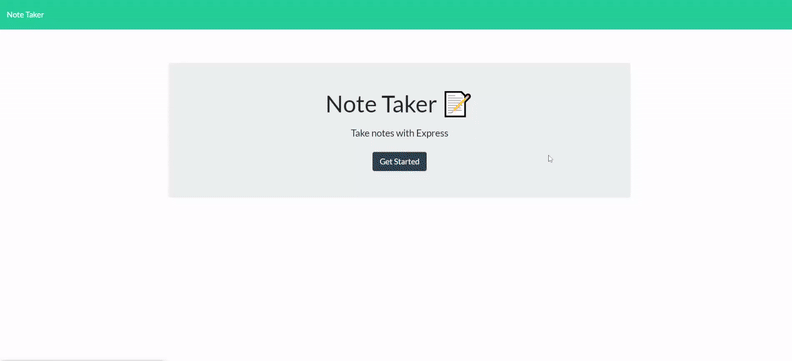

# 11-Note-Taker

[](https://opensource.org/licenses/MIT)

  ## Description:
  This is a simple Note Taking application that allows users to add, view, and delete the notes. This application uses an express backend and save and retrieve note data from a JSON file.

  

  ## Deployed:
  This application is deployed on Heroku at:
  [Note Taker](https://omar-a-note-taker.herokuapp.com/)

  ## Table of Contents 
  - [Description](#description)
  - [Deployed](#deployed)
  - [License](#license)
  - [Usage](#usage)
  - [Features](#features)
  - [Contribution](#contribution)
  - [Questions](#questions)

  ## License:
  [](https://opensource.org/licenses/MIT)

  ## Usage:
  - Clone this repository on your local machine.
  - Open your terminal
  - To install necessary dependencies, type:
  ```
  npm install
  ```
  - The application will be invoked with the following command: This will start localhost server on PORT 3000.
  ```
  node server.js
  ```
  - Open browser and type `http://localhost:3000/` to run this application on your local machine.

  # Features :

  1. Used 'Express.js' to build server

  2. Used 'fs(File System)' module to read and write from 'db.json' file.

  3. Used [uuid](https://www.npmjs.com/package/uuid) npm package to give unique id to each note.

  4. Application is deployed on [heroku](https://www.heroku.com/) : Heroku is a container-based cloud Platform as a Service (PaaS). Developers use Heroku to deploy, manage, and scale modern apps.

  ## Questions:
  Have any questions?\
  Feel free to contact me at:
  - Github: [OmarAce](https://github.com/OmarAce)
  - Email: omarace95@gmail.com